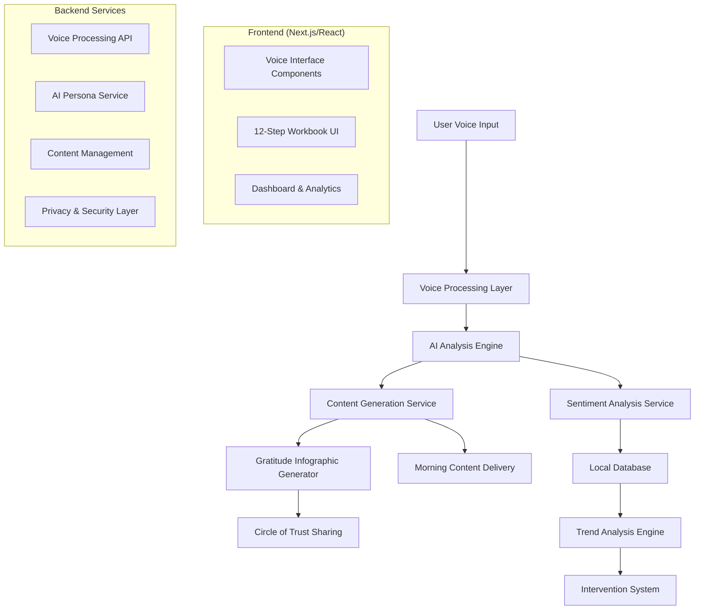

# Design Document

## Overview

The Voice Recovery Companion is a Next.js-based web application that provides voice-interactive recovery support through nightly 10th step inventory, gratitude practices, morning content delivery, and comprehensive 12-step workbook functionality. The system leverages modern web APIs for voice processing, AI services for content generation and sentiment analysis, and local storage for privacy-sensitive data.

## Architecture

### High-Level Architecture



### Technology Stack

- **Frontend**: Next.js 14+ with React 18+, TypeScript
- **Voice Processing**: Web Speech API, Web Audio API
- **AI Services**: OpenAI GPT-4 for persona and content generation
- **Sentiment Analysis**: Azure Cognitive Services or AWS Comprehend
- **Local Storage**: IndexedDB with encryption
- **Image Generation**: DALL-E 3 or Midjourney API for infographics
- **Audio Processing**: Web Audio API for tone analysis
- **Scheduling**: Browser-based scheduling with service workers

## Components and Interfaces

### 1. Voice Interface Layer

**VoiceRecognitionService**
```typescript
interface VoiceRecognitionService {
  startListening(): Promise<void>
  stopListening(): Promise<string>
  onSpeechResult(callback: (text: string) => void): void
  onSpeechEnd(callback: () => void): void
}
```

**TextToSpeechService**
```typescript
interface TextToSpeechService {
  speak(text: string, options?: SpeechOptions): Promise<void>
  setVoice(voice: SpeechSynthesisVoice): void
  pause(): void
  resume(): void
}
```

### 2. AI Persona System

**RecoveryExpertPersona**
```typescript
interface RecoveryExpertPersona {
  generateStepGuidance(step: number, userContext: string): Promise<string>
  provideInventoryPrompts(sessionHistory: InventorySession[]): Promise<string[]>
  createMotivationalContent(userState: UserEmotionalState): Promise<string>
  validateStepWork(stepNumber: number, userResponse: string): Promise<ValidationResult>
}
```

### 3. Sentiment and Tone Analysis

**VoiceAnalysisEngine**
```typescript
interface VoiceAnalysisEngine {
  analyzeSentiment(text: string): Promise<SentimentScore>
  analyzeTone(audioBuffer: ArrayBuffer): Promise<ToneAnalysis>
  detectEmotionalMarkers(analysis: VoiceAnalysis): EmotionalMarkers
  storeTrendData(userId: string, analysis: VoiceAnalysis): Promise<void>
}
```

### 4. Content Generation Services

**PodcastGenerator**
```typescript
interface PodcastGenerator {
  generateScript(inventoryData: InventorySession, userPreferences: UserPreferences): Promise<string>
  synthesizeAudio(script: string): Promise<AudioBuffer>
  includeDailyReadings(date: Date): Promise<string[]>
}
```

**InfographicGenerator**
```typescript
interface InfographicGenerator {
  createGratitudeVisual(gratitudeItems: string[], style: VisualStyle): Promise<ImageBlob>
  customizeForUser(template: Template, userPreferences: UserPreferences): Template
  optimizeForSharing(image: ImageBlob): Promise<ImageBlob>
}
```

### 5. 12-Step Workbook System

**StepWorkbookManager**
```typescript
interface StepWorkbookManager {
  getStepContent(stepNumber: number): Promise<StepContent>
  saveStepResponse(stepNumber: number, response: VoiceResponse): Promise<void>
  generateSponsorSummary(stepNumber: number): Promise<SponsorSummary>
  trackProgress(): Promise<ProgressReport>
}
```

## Data Models

### Core Data Structures

```typescript
interface InventorySession {
  id: string
  date: Date
  responses: InventoryResponse[]
  sentimentAnalysis: SentimentScore
  toneAnalysis: ToneAnalysis
  insights: string[]
  encrypted: boolean
}

interface GratitudeEntry {
  id: string
  date: Date
  items: string[]
  infographicUrl?: string
  sharedWith: string[]
  voiceRecording?: ArrayBuffer
}

interface StepWorkEntry {
  stepNumber: number
  responses: VoiceResponse[]
  completionDate?: Date
  sponsorShared: boolean
  reviewNotes?: string
}

interface UserEmotionalState {
  currentMood: MoodLevel
  trendDirection: 'improving' | 'declining' | 'stable'
  riskFactors: string[]
  lastAnalysis: Date
}

interface CircleOfTrust {
  contacts: TrustedContact[]
  sharingPreferences: SharingPreferences
  communicationMethods: ContactMethod[]
}
```

### Privacy and Security Models

```typescript
interface EncryptedData {
  encryptedContent: string
  iv: string
  salt: string
  timestamp: Date
}

interface PrivacySettings {
  dataRetentionDays: number
  shareGratitudeOnly: boolean
  allowTrendAnalysis: boolean
  autoDeleteSensitive: boolean
}
```

## Error Handling

### Voice Processing Errors
- **Microphone Access Denied**: Graceful fallback to text input with explanation
- **Speech Recognition Failure**: Retry mechanism with user notification
- **Network Connectivity Issues**: Offline mode with local processing where possible

### AI Service Failures
- **API Rate Limiting**: Queue requests and implement exponential backoff
- **Content Generation Errors**: Fallback to pre-written templates
- **Sentiment Analysis Unavailable**: Basic keyword-based analysis as backup

### Data Storage Errors
- **IndexedDB Quota Exceeded**: Automatic cleanup of old data with user consent
- **Encryption Failures**: Secure error logging without exposing sensitive data
- **Sync Failures**: Local-first approach with eventual consistency

## Testing Strategy

### Unit Testing
- Voice processing components with mock audio data
- AI persona responses with predefined scenarios
- Encryption/decryption functions with various data types
- Sentiment analysis accuracy with known emotional content

### Integration Testing
- End-to-end voice session workflows
- Cross-browser compatibility for Web Speech API
- AI service integration with rate limiting scenarios
- Local database operations under various storage conditions

### User Experience Testing
- Voice command recognition accuracy across different accents
- Response time optimization for real-time interactions
- Accessibility compliance for users with disabilities
- Privacy controls and data deletion verification

### Security Testing
- Encryption key management and rotation
- Local data storage security audit
- Network communication security (HTTPS, API keys)
- User consent and privacy preference enforcement

## Performance Considerations

### Voice Processing Optimization
- Real-time audio processing with minimal latency
- Efficient audio buffer management
- Background processing for non-critical analysis

### AI Service Efficiency
- Request batching for multiple AI operations
- Caching of frequently used persona responses
- Streaming responses for long-form content generation

### Local Storage Management
- Automatic data archiving and cleanup
- Efficient indexing for trend analysis queries
- Compression for voice recordings and large text data

## Deployment and Scalability

### Progressive Web App Features
- Service worker for offline functionality
- Push notifications for scheduled reminders
- Background sync for data processing

### Privacy-First Architecture
- Client-side encryption before any network transmission
- Minimal server-side data storage
- User-controlled data retention policies
- GDPR and HIPAA compliance considerations